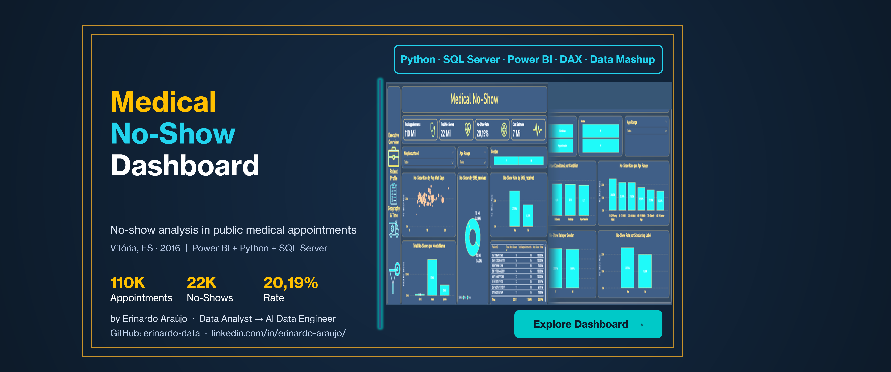

# Medical No-Show Dashboard

> End-to-end data project — from raw CSV to interactive Power BI dashboard,
> built with a full Medallion architecture on a local data engineering stack.

🔗 **[View Live Dashboard](https://app.powerbi.com/groups/a694339e-5c6e-4cb3-a768-274be4c805d0/reports/6c6d5fc6-9166-4c6c-a5c3-4df661d13a4f)**

---

## 📌 Project Summary

Analysis of **110,527 medical appointments** from the public healthcare system
of Vitória, ES, Brazil (2016), focused on understanding why **1 in 5 patients
never shows up** for their scheduled appointment — and what the data reveals
about the behavioral, clinical, and geographic drivers behind that pattern.

---

## 🛠️ Stack

| Layer          | Tools                                      |
|----------------|--------------------------------------------|
| Ingestion      | Python 3.12 · pandas · pyodbc              |
| Storage        | SQL Server (local) · CSV · Excel · Parquet |
| Transformation | Python · SQL (T-SQL)                       |
| Visualization  | Power BI Desktop · DAX                     |
| Environment    | WSL2 Ubuntu · zsh · uv · VS Code          |
| Versioning     | Git · GitHub (SSH)                         |

---

## 🏗️ Architecture — Medallion

    Kaggle CSV (raw)
         ↓
      BRONZE — raw import, nullable, VARCHAR dates, 110,527 rows
         ↓
      SILVER — cleaned, typos fixed, quality filters, 110,498 rows
         ↓
      GOLD — 3 formats:
             CSV      → portability
             Excel    → non-technical stakeholders
             Parquet  → international DE standard

---

## 📊 Key Insights

| Insight              | Finding                                                                 |
|----------------------|-------------------------------------------------------------------------|
| Overall No-Show Rate | **20.19%** — 1 in 5 patients misses their appointment                  |
| Estimated Cost       | **R$ 6.69M** — based on R$ 300 per lost appointment                    |
| SMS Paradox          | SMS receivers show **higher** no-show rate (27.58% vs 16.70%) — confounding variable: SMS was sent preferentially to long-wait appointments |
| Worst Neighborhood   | Santos Dumont — **28.92%** (n=1,276, statistically significant)        |
| Worst Age Group      | 18–29 Young Adults — **24.65%**                                        |
| Worst Day            | Saturday — **23.08%**                                                  |
| Potential Fraud      | Patients with **100% no-show rate** across 10–18 consecutive appointments detected |
| Scholarship Impact   | Bolsa Família recipients — **23.74%** vs 19.80% without               |
| Clinical Conditions  | Alcoholism leads among conditions — ~20% no-show rate                  |

---

## 📋 Dashboard Pages

| Page                   | Description                                                        |
|------------------------|--------------------------------------------------------------------|
| **Cover Page**         | Animated entry with stack badges and live dashboard link           |
| **Executive Overview** | KPIs, scatter plot, SMS impact, reincident patients table          |
| **Patient Profile**    | Clinical conditions, age range, gender, scholarship analysis       |
| **Geography & Time**   | Top 10 neighborhoods, day of week, dataset limitations log         |

---

## 🗂️ Dataset Limitations

- April and June are **partial months** — only May is complete
- No latitude/longitude — map visual not possible
- No time stored in AppointmentDay — hourly analysis not possible
- Neighbourhood is text only — no geospatial join possible
- Dataset is static (2016) — no refresh or streaming

---

## 🧠 Decision Log — 21 Documented Decisions

| #  | Decision                                      | Rationale                                                              |
|----|-----------------------------------------------|------------------------------------------------------------------------|
| 1  | SSH over HTTPS                                | Signals higher technical maturity to recruiters                        |
| 2  | SQL Login over Windows Auth                   | Simulates real corporate environment credentials                       |
| 3  | TINYINT for binary flags                      | Minimal storage for 0/1 columns                                        |
| 4  | Bronze nullable                               | Never block raw import — preserve source fidelity                      |
| 5  | ROWTERMINATOR='0x0a'                          | Hex literal handles LF line endings reliably                           |
| 6  | Gold with 3 formats                           | CSV (portability) · Excel (stakeholders) · Parquet (DE standard)       |
| 7  | Dates as VARCHAR in Bronze                    | Faithful to source — transformation belongs in Silver                  |
| 8  | AppointmentDay without time                   | Source has no time component — no inference                            |
| 9  | Parquet via C:\temp\ bridge                   | WSL2 to Windows file system handoff for Power BI compatibility         |
| 10 | Partial dataset (April/June)                  | Documented limitation — May is the only complete month                 |
| 11 | Neighborhoods n<30 removed                    | Statistical significance threshold                                     |
| 12 | Sunday excluded from Day of Week              | Public healthcare system does not operate on Sundays                   |
| 13 | f_clinical_conditions_unpivot no relationship | Avoids many-to-many anti-pattern in Power BI model                     |
| 14 | COALESCE on all measures                      | Prevents BLANK propagation across visuals                              |
| 15 | WaitDays as calculated column                 | Row-level calculation — needs row context, not filter context          |
| 16 | Avg Wait Days as measure                      | Aggregation — needs filter context from slicers                        |
| 17 | Short Date in locale menu                     | Production behavior over DAX CONVERT() — portfolio honesty             |
| 18 | No-Show Rate <= 1 filter on scatter           | Removes calculation artifacts from visual                              |
| 19 | Top N filter (N=10) on neighborhood bar       | Readability over completeness                                          |
| 20 | Donut SMS does not support empty state        | Native Power BI limitation — documented, not hidden                    |
| 21 | "Todos" persists in dropdown slicers          | Native locale behavior — pt-BR installation                            |

---

## 📁 Repository Structure

    medical-no-shows/
    ├── data/
    │   ├── bronze/          # raw CSV from Kaggle
    │   ├── silver/          # cleaned CSV
    │   └── gold/            # CSV + Excel + Parquet
    ├── docs/
    │   ├── cover_page.png
    │   ├── dashboard_background.png
    │   └── click_here_navigate.gif
    ├── notebooks/
    │   └── eda.ipynb
    ├── src/
    │   ├── silver_transform.py
    │   ├── gold_export.py
    │   └── sql/
    │       ├── 01_create_database.sql
    │       ├── 02_create_table_bronze.sql
    │       ├── 03_bulk_insert_bronze.sql
    │       └── 04_eda_bronze.sql
    ├── README.md
    └── requirements.txt

---

## 🗺️ Roadmap

| Phase    | Target                                          |
|----------|-------------------------------------------------|
| P1 ✅    | Medical No-Shows — local stack (current)        |
| P2       | Project Management Dashboard — Power BI         |
| P4+      | Databricks · GCP · Azure · Microsoft Fabric     |

---

## 👤 Author

**Erinardo Araújo** · Data Analyst → AI Data Engineer
🔗 [LinkedIn](https://linkedin.com/in/erinardo-araujo-682347295)
🐙 [GitHub](https://github.com/erinardo-data)